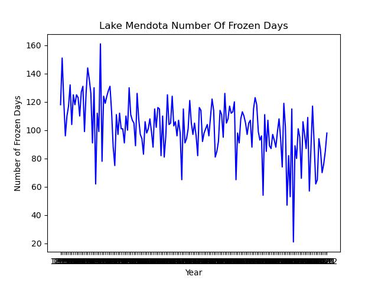
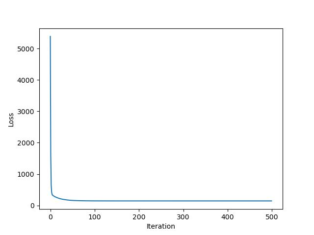

# Lake Mendota Ice Cover: Linear Regression from Scratch

Is Lake Mendota (Madison, WI) freezing for fewer days each winter? This project fits a linear trend to the lake's annual ice-cover record, which starts in 1855. It solves the same model two ways with NumPy only (no ML libraries): the **closed-form normal equation** and **batch gradient descent**. It then uses the trend to extrapolate.



## Method

1. **Features**: years are min-max normalized to [0, 1], and a bias column is added. The design matrix is `X = [x_norm, 1]`.
2. **Closed form**: `w = (XᵀX)⁻¹ Xᵀy`.
3. **Gradient descent**: minimizes the mean squared error, `L = (1/2n)·Σ(Xw − y)²`, with gradient `(1/n)·Xᵀ(Xw − y)`. The loss curve below shows it converging to the closed-form solution.
4. **Interpretation**: the sign of the slope gives the direction of the trend, and solving `w·x + b = 0` gives the year the fitted line reaches zero ice days.



## Results

With learning rate 0.4 and 500 iterations:

| Quantity | Value |
| --- | --- |
| Slope sign | **negative**: ice cover is shrinking over time |
| Predicted ice days in 2023 | ≈ 85.5 |
| Year the linear trend reaches 0 ice days | ≈ 2463 |

The last number is a naive linear extrapolation. Real ice cover depends on nonlinear climate dynamics, so read it as an illustration of the trend, not a forecast.

## Usage

```bash
pip install -r requirements.txt
python ice_regression.py ice_data.csv 0.4 500   # <data> <learning_rate> <iterations>
```

The script prints the normalized design matrix, the closed-form weights, the gradient-descent weights (every 10 iterations), the 2023 prediction, and the zero-ice year. It also saves both plots.

Data: annual Lake Mendota ice-cover durations, as published by the Wisconsin State Climatology Office.

---

*Date finished: March 3, 2025*
